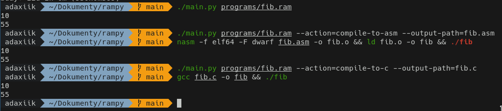
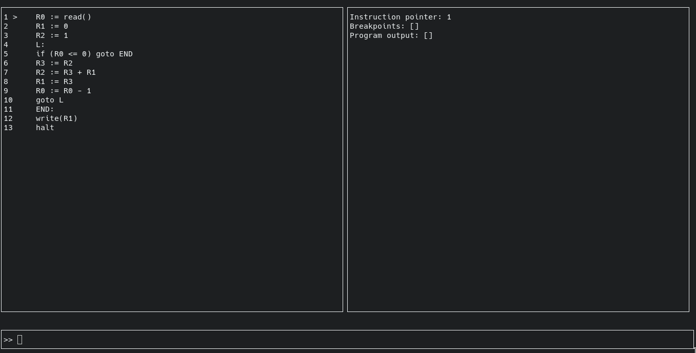
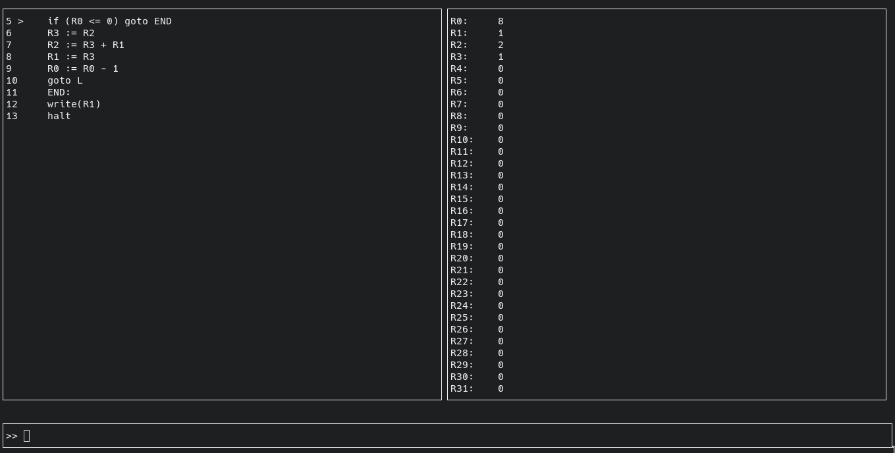

# rampy
RAM interpreter and compiler in python

## RAM?
- RAM stands for Random Access Machine
- This is a simple implementation of a RAM as described [here](https://www.cs.vsb.cz/sawa/uti/slides/uti-06-cz.pdf) on slide 86

| Instruction | Description |
|-------------|-------------|
| `R_ := c` | R stands for register, _ stands for register number, c stands for constant, := stands for assignment.. assign constant to register |
| `R_ := R_` | assign register to register |
| `R_ := [R_]` | Load instruction.. described down below |
| `[R_] := R_` | Store instruction|
| `R_ := R_ <op> R_` | Assign result of operation to register, op stands for operation, can be +, -, *, / |
| `R_ := R_ <op> c` | Assign result of operation to register |
| `if (R_ <rel> R_) goto <label>` | If statement, rel stands for relation, can be <, >, <=, >=, ==, !=.. label can be label name, or instruction to jump on|
| `goto <label>` | Jump to label |
| `halt` | Stop execution |
| `R_ := read()` | Read input from stdin and assign to register |
| `write(R_)` | Write register to stdout |

- Everything after parsed instruction is ignored, so you can write comments after instruction
### Load/Store instruction
- See this [example](programs/load_store.ram)
```ram
R0 := 69
R1 := [R0]
```
is equivalent to
```ram
R1 := R69
```

and
```ram
R0 := 123
R1 := 420
[R0] := R1
```
is equivalent to
```ram
R123 := 420
```


## Example
- for more examples see [programs](programs) folder
```ram
R0 := read()
L0:
if (R0 < 0) goto L1
write(R0)
R0 := R0 - 1
goto L0
L1:
halt        // comment.. ignored
```
- This program reads single number from stdin, and then prints R0..0 to stdout

## Usage
- `python3 rampy.py <file>` for interpreting
- `python3 rampy.py <file> --action=debug` for debugging
- `python3 rampy.py --help` for more info

## Compilation
- currently is fully supported only C and NASM
- both C and NASM using 64bit signed integers and has 2048 registers (R0..R2047)
```sh
./main.py programs/fib.ram --action=compile-to-c --output-path=fib.c
gcc fib.c -o fib
./fib
```
```sh
./main.py programs/fib.ram --action=compile-to-asm --output-path=fib.asm
nasm -f elf64 -F dwarf fib.asm -o fib.o && ld fib.o -o fib
./fib
```





